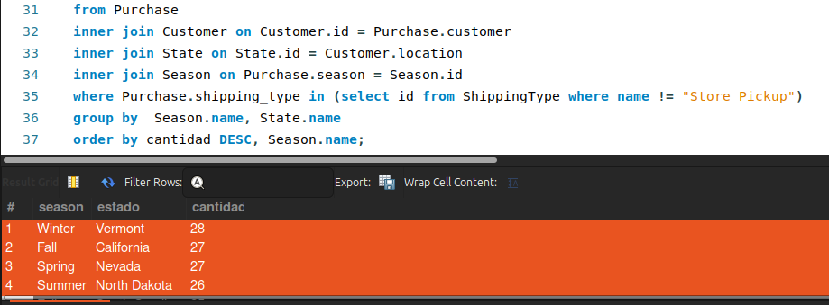
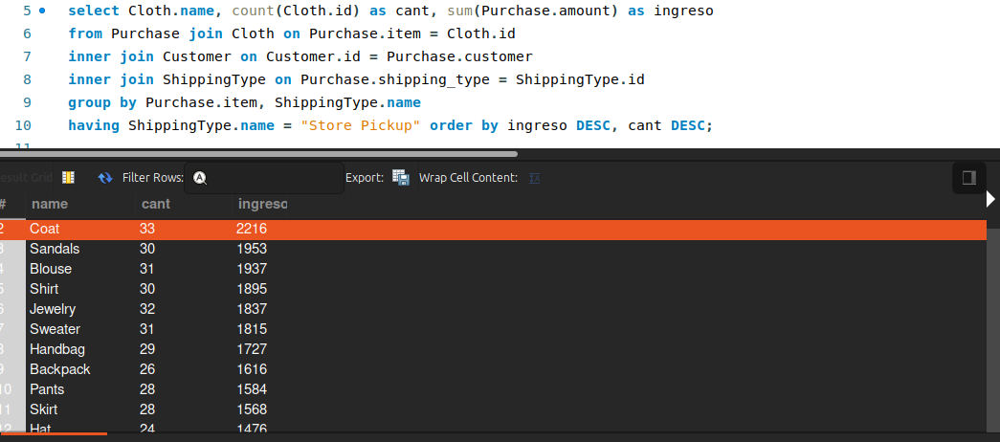
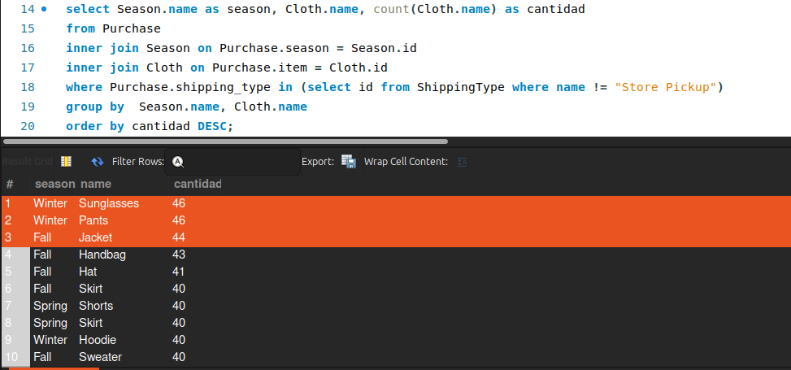
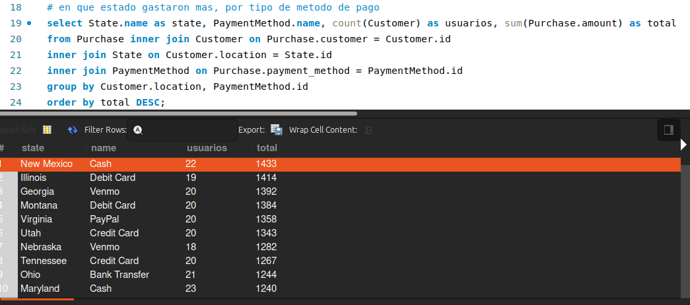

# Proyecto SQL
### Customer Shopping (Latest Trends) Dataset

*Ulises Rodrigo Gonzalez Osnaya*

<!--
header: ''
footer: '[diplomado en ciencia de datos | BEDU](https://bedu.org/diplomado-en-data-science/)'
-->
---
# Dataset
## Criterios de selección 

- alto volumen de datos 
- contexto simple
- contar con más de 10 caracterísiticas (columnas)

---

# Dataset
## Problemática

Dataset: [Customer Shopping (Latest Trends) Dataset](https://www.kaggle.com/datasets/bhadramohit/customer-shopping-latest-trends-dataset)

Objetivo: Apoyar la **toma de decisiones** del sector retail (Moda)

---
# Dataset
## Problemática

el dataset propuesto recomienda los siguientes enfoques:

- _Analyze consumer purchasing patterns over time._

- **_Identify popular product categories and high-performing segments._**

- _Develop customer segmentation and personalization strategies._

- _Build predictive models for sales forecasting or customer retention._

---

# Dataset
## Análisis

---

# Dataset

<table>
<tr>
    <td>Rows:
    <td>3,900
    <td>Columns:
    <td> 19
</table>
<table>
<tr>
    <td>Customer ID
    <td>Age
    <td>Gender
<tr>
    <td>Item Purchased
    <td>Category
    <td>Purchase Amount (USD)
<tr>
    <td>Location
    <td>Size
    <td>Color
<tr>
    <td>Season
    <td>Review Rating
    <td>Subscription Status
<tr>
    <td>Payment Method
    <td>Shipping Type
    <td>Discount Applied
<tr>
    <td>Promo Code Used
    <td>Previous Purchases
<tr>
    <td>Preferred Payment Method
    <td>Frequency of Purchases
</table>

---

# Dataset
## preprocesamiento

- se reemplazan valores "yes", "no" por constantes TRUE, FALSE
- se eliminan espacios en blanco despues del separador 

---

# Base de Datos
## Diseño _modelado de entidades independientes_

Notamos que se pueden crear entidades para almacenar valores discretos que pueden funcionar como Enums (id, valor/etiqueta). 

<table>
<tr>
    <td>Gender
    <td>Size
    <td>Color
    <td>Category
<tr>
    <td>Season
    <td>PaymentMethod
    <td>ShippingType
    <td>Frenquency
<tr>
    <td>State
</table>

---
# Base de Datos
## Diseño _modelado de entidades independientes_

<table>
<tr>
    <td>Cloth
<tr>
    <td>Customer
<tr>
    <td>Purchase
</table>

---

# Base de Datos
## Diseño script para tablas

[script](https://github.com/ulywhy/DataSienceBedu/blob/main/bloque1/proyecto/createDatabase.sql)

---

# Base de Datos
## Diseño scripts para inserts

cargamos el csv en Atlas y con ayuda de filtros obtuvimos los valores de los Enums, para poblar los inserts. [script](https://github.com/ulywhy/DataSienceBedu/blob/main/bloque1/proyecto/enum_Inserts.sql)

---

# Base de Datos
## Diseño scripts para inserts

Para insertar en las tablas dependientes creamos un script en Bash para Parsear el CSV, que genera un [archivo de salida](https://github.com/ulywhy/DataSienceBedu/blob/main/bloque1/proyecto/insertCustomers.sql) con los inserts correspondientes y select anidados para obtener los Id de los Enum. [script](https://github.com/ulywhy/DataSienceBedu/blob/main/bloque1/proyecto/load_data.sh)

---

# Base de Datos
## implementación local

ejecutamos:
- construcción del esquema (createDatabase.sql)
- insertar Enums (enum_insert.sql)
- insertar tablas dependientes (insertCustomers.sql, insertPurchases.sql)

---

---

# Análisis ¿A qué estado se envian más productos en cada temporada y de cuánto es el ingreso?

---

# Análisis  ¿Cuál es el producto más vendido en tiendas?

---

# Análisis ¿En qué temporada se envian más productos y cuáles son?

---

# Análisis ¿en qué estado gastaron más, por tipo de método de pago?

---

# Conclusiones
- es importante cruzar mas datos para obtener información con mayor detalle para toma de decisiones especificas.

- dado el diseño normalizado de la BD los queries pueden ser complejos y dificil de mantener

- puese ser coveniente el uso de vistas para presentar los datos sin normalización.

