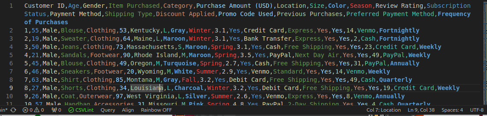
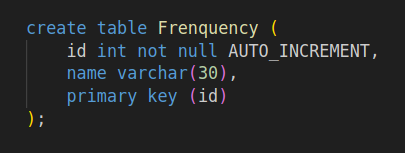
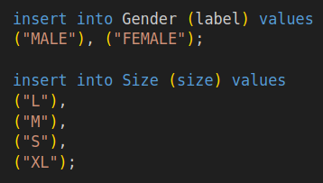
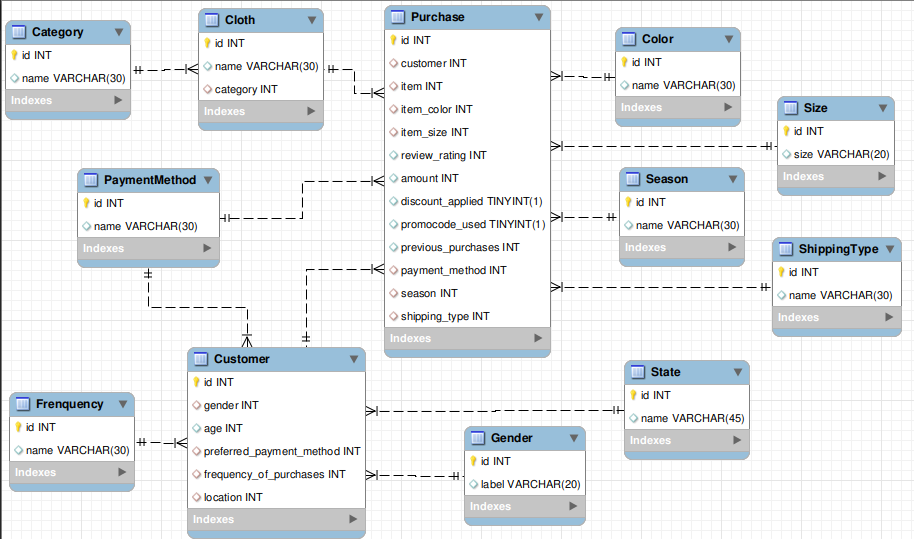
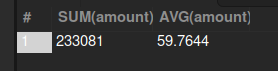
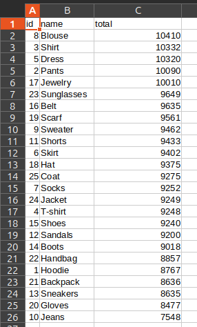
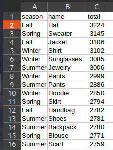

# Proyecto SQL
### Customer Shopping (Latest Trends) Dataset

*Ulises Rodrigo Gonzalez Osnaya*

<!--
header: ''
footer: '[diplomado en ciencia de datos | BEDU](https://bedu.org/diplomado-en-data-science/)'
-->
---
# Dataset
## Criterios de selección 

- alto volumen de datos 
- contexto simple
- contar con más de 10 caracterísiticas (columnas)

---

# Dataset
## Problemática

Dataset: [Customer Shopping (Latest Trends) Dataset](https://www.kaggle.com/datasets/bhadramohit/customer-shopping-latest-trends-dataset)

Objetivo: Apoyar la **toma de decisiones** del sector retail (Moda)

---
# Dataset
## Problemática

el dataset propuesto recomienda los siguientes enfoques:

- **_Analyze consumer purchasing patterns over time._**

- **_Identify popular product categories and high-performing segments._**

- _Develop customer segmentation and personalization strategies._

- _Build predictive models for sales forecasting or customer retention._

---

# Dataset
## Análisis

---

# Dataset
## preprocesamiento

- se reemplazan valores "yes", "no" por constantes TRUE, FALSE
- se eliminan espacios en blanco despues del separador 
---

# Dataset

<table>
<tr>
    <td>Rows:
    <td>3,900
    <td>Columns:
    <td> 19
</table>
<table>
<tr>
    <td>Customer ID
    <td>Age
    <td>Gender
<tr>
    <td>Item Purchased
    <td>Category
    <td>Purchase Amount (USD)
<tr>
    <td>Location
    <td>Size
    <td>Color
<tr>
    <td>Season
    <td>Review Rating
    <td>Subscription Status
<tr>
    <td>Payment Method
    <td>Shipping Type
    <td>Discount Applied
<tr>
    <td>Promo Code Used
    <td>Previous Purchases
<tr>
    <td>Preferred Payment Method
    <td>Frequency of Purchases
</table>

---

# Base de Datos
## Diseño _modelado de entidades independientes_

Notamos que se pueden crear entidades para almacenar valores discretos que pueden funcionar como Enums (id, valor/etiqueta). 

<table>
<tr>
    <td>Gender
    <td>Size
    <td>Color
    <td>Category
<tr>
    <td>Season
    <td>PaymentMethod
    <td>ShippingType
    <td>Frenquency
<tr>
    <td>State
</table>

---
# Base de Datos
## Diseño _modelado de entidades independientes_

Las evaluaciones de los clientes no necesitan referencia hacia otras tablas.

<table>
<tr>
    <td>Cloth
    <td>
<tr>
    <td>Customer
    <td>
<tr>
    <td>Review
    <td>podria manejarse una referencia circular al cliente que la emitió
<tr>
    <td>Purchase
    <td>
</table>

---

# Base de Datos
## Diseño script para tablas

[script](https://github.com/ulywhy/DataSienceBedu/blob/main/bloque1/proyecto/createDatabase.sql)

---

# Base de Datos
## Diseño scripts para inserts

cargamos el csv en Atlas y con ayuda de filtros obtuvimos los valores de los Enums, para poblar los inserts. [script](https://github.com/ulywhy/DataSienceBedu/blob/main/bloque1/proyecto/enum_Inserts.sql)

---

# Base de Datos
## Diseño scripts para inserts

Para insertar en las tablas dependientes creamos un script en Bash para Parsear el CSV, que genera un [archivo de salida](https://github.com/ulywhy/DataSienceBedu/blob/main/bloque1/proyecto/insertCustomers.sql) con los inserts correspondientes y select anidados para obtener los Id de los Enum. [script](https://github.com/ulywhy/DataSienceBedu/blob/main/bloque1/proyecto/load_data.sh)

---

# Base de Datos
## implementación local

ejecutamos:
- construcción del esquema (createDatabase.sql)
- insertar Enums (enum_insert.sql)
- insertar tablas dependientes (insertCustomers.sql)

---

---

# Análisis ¿Cual es el total y promedio de compras?

[script](https://github.com/ulywhy/DataSienceBedu/blob/main/bloque1/proyecto/analysisQueries.sql)
---

# Análisis ¿Cual es el total de ventas por producto?

---

# Análisis ¿Que temporada tiene el producto mas/menos vendido y cúal es?

---

- ¿En que estado compran mas productos?
- ¿En que estado gastaron mas?
- ¿Cual es el metodo de pago mas/menos utilizado por region? 
- ¿Como se distribuye la edad de los clientes?
- ¿Quienes son los clientes que compran frecuentemente?  

---

# Conclusiones
- es importante cruzar mas datos para obtener información con mayor detalle para toma de decisiones especificas, pero dado el diseño normalizado de la BD los queries pueden ser complejos y dificil de mantener; Es posible el uso de StoredProcedures para el procesamiento de datos por etapas, una desventaja puede ser el tiempo de procesamiento.

Recomendamos utilizar los datos sin normalizar tal cual se obtienen del csv, se consideró este enfoque con SQL para practica de conceptos SQL.

